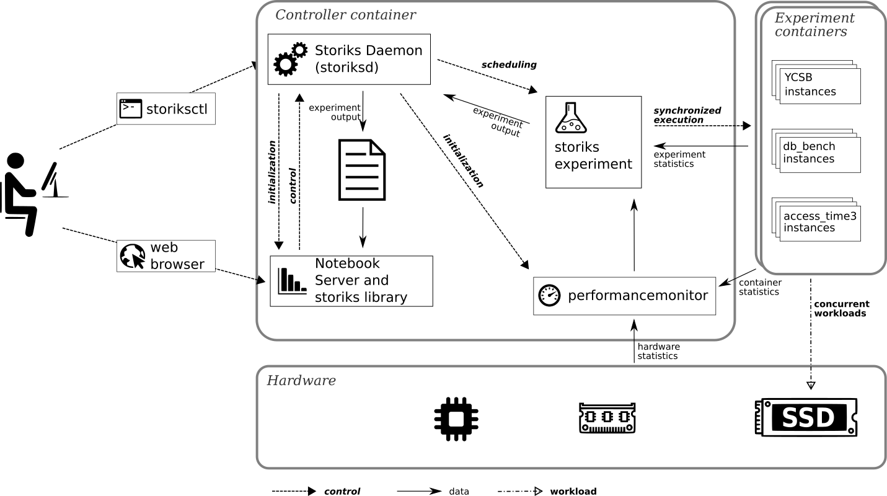

# STORIKS

Storiks (Storage Resource Interferometer for Key-value Stores) is a framework designed to evaluate the performance interference a key-value store may suffer when sharing the same storage device with other concurrent workloads.

## Quick Guide

1. Download the latest stable [storiksctl](https://github.com/alange0001/storiks/raw/stable/storiksctl) and set it as executable.
	For convenience, you may save this file in a directory listed in PATH.
1. Start storiks daemon, a docker container named storiks:
	```
	$ ./storiksctl start --foreground --data_dir=/path2/device/fs --output_dir=/path2/output_directory
	```
	Notes:
	 * You must have permission to launch docker containers.
	 * --foreground will launch storiks attached to the current terminal to see logs. Ctrl-C terminates the container in this case. Remove this option if you want it running in the background.
	 * The main storiks container will execute as --privileged to collect statistics from the host.
	 * This container will also be automatically removed when stopped so that you must store all data in the directories --data_dir and --output_dir.
	   * --data_dir corresponds to a directory mounted in the device under test. Inside the storiks container, it corresponds to /workdata.
	   * --output_dir is the directory used to store experiment instructions and results. It corresponds to /output inside storiks container.
1. Open the internal jupyter-notebook interface.
	* In the same machine with **gui interface**:
		```
		$ ./storiksctl open
		```
		It will call xdg-open with the notebook url.
	* In a **headless** machine, use:
		```
		$ ./storiksctl status
		```
		to get the notebook url.
1. If necessary, open a terminal inside storiks container:
	```
	$ ./storiksctl terminal
	```
1. Stop when no longer necessary:
	```
	$ ./storiksctl stop
	```

More information about storiksctl commands is available using --help parameter.

## Architecture

The following diagram depicts the main components of the storiks framework.



### Main Executables

* **storiksctl** (host side) - Controls the initialization, status, and communication with storiks container.
* **storiksd** (inside the storiks container) - Is responsible for setting up the storiks container environment, initializing its main subprocesses, and controlling the scheduled experiments.
	* There is must be only one instance of storiksd running inside the storiks container.
	* User can send commands to storiksd from the host by using the ***storiksctl send*** command. Use ***storiksctl send help*** to see the commands available.
* **storiks** (inside the storiks container) - Controls the lifetime of the experiments by initializing one container per concurrent workload, and reporting statistics. Each execution of storiks corresponds to one experiment and there must be only one instance of this program running at a time.
	* Each experiment may be defined as a list of parameters passed to the storiks program or even as [flagfiles](https://gflags.github.io/gflags/), preferably inside /output (--output_dir).
	* Use ***storiks --help*** inside storiks container to see the available options.
	* It is recommended to schedule the experiments in **storiksd**.
		* From host, use:
			```
			./storiksctl send schedule --output experimentX.out storiks --flagfile=experimentX.flags
			```
		* From notebook interface, use the python function ***storiks.run.send***. See [/output/examples/run.ipynb](examples/examples/run.ipynb) for more examples.
